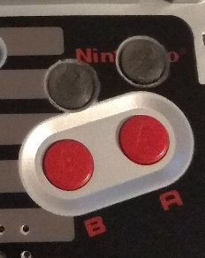

# 3d print parts

### Screen frame 3.2 & 2.8

-----

### X & Y buttons stopper

### X & Y buttons

### Battery support

#### All these 3d parts were made and tested by "Marko" special thanks to him!

### Download link:
##### [Click here](https://drive.google.com/uc?id=14g3um4zb2x2o7MlhX-fVQA4-p77Zz1wU&export=download)

Tips from the designer :
- Buttons 
   Print buttons with nub down and supports. This worked best for me and my 3d printer
- Button stopper
   Put both x & y in to the drilled holes on your sp case, Place your stopper and use a small amount of hot glue or two part epoxy(less is more with epoxy) to hold it in place
- 2.8 & 3.2 screen frame
  2.8 is simple, remove the metal braket on the back of the lcd and slide it into the printed frame and install. 
  3.2 - You will need to mod your sp case, lcd and remove the metal braket, Slide it into the printed part and install it into your case. This does need a bit of work to get it to fit in but you should not need to mod anything.
  3.2 printing - I found printing the face up worked much better than printing it down, you will need suports.
- Battery stopper
  I found that the sp case did not support the battery connector well and I had it actually bend back. This should simply slide into your sp case without modding it and help support the connector.

Thanks and enjoy!!!!! 

-----
