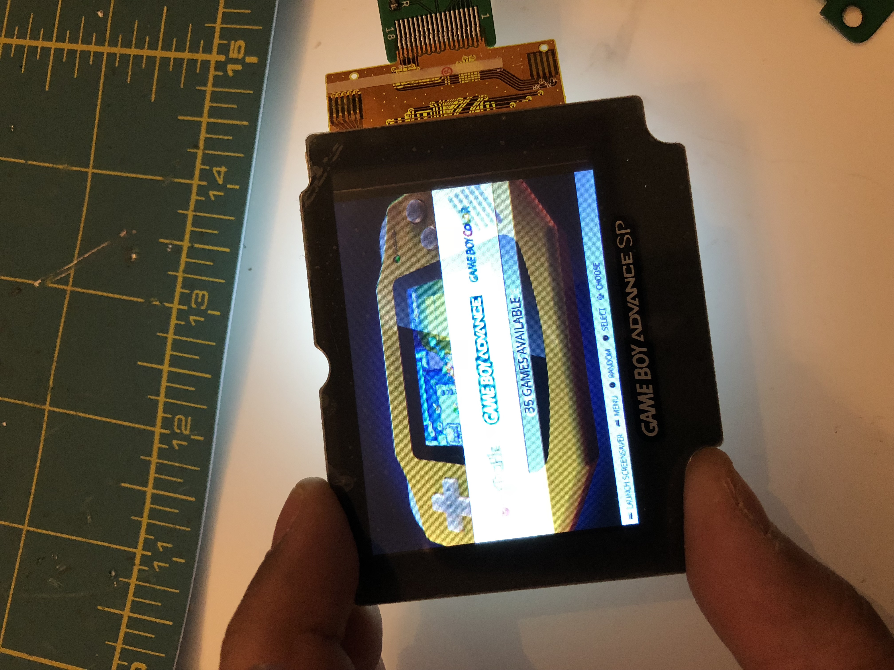
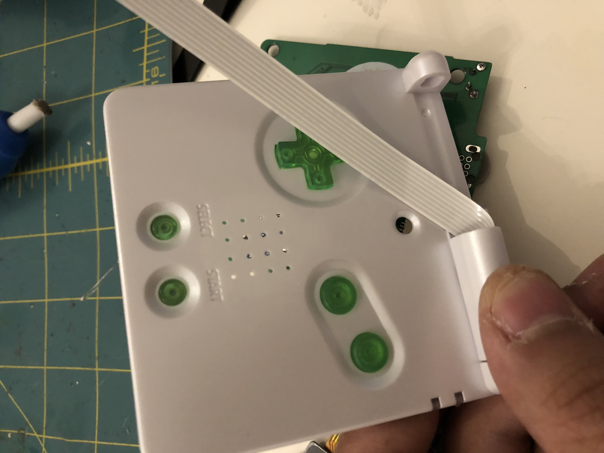
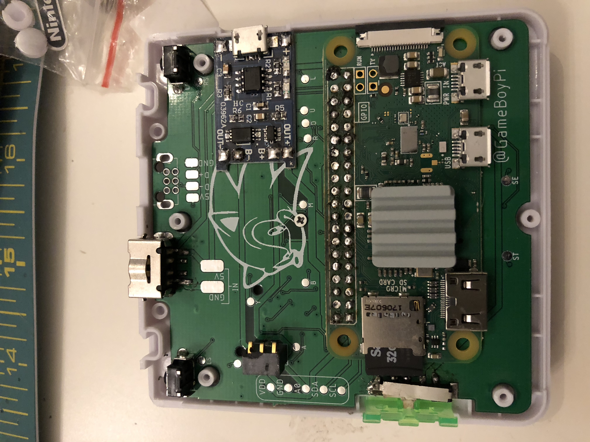

# Final Assembly

### Prepare your screen lens and lined them up on the screen

### Unplug the screen ribbon cable

### insert the screen cable through the case 

### screw your board "  There is only one screw to hold the board "

### Heat sink "This step is optional but I recommend it"

### Close the housing 

### Connect the screen cable and place it in its cover 

### Congratulations you're done

