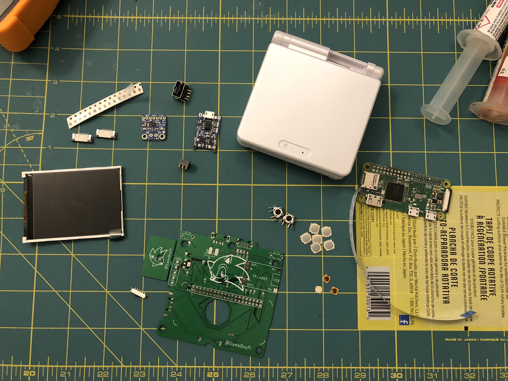
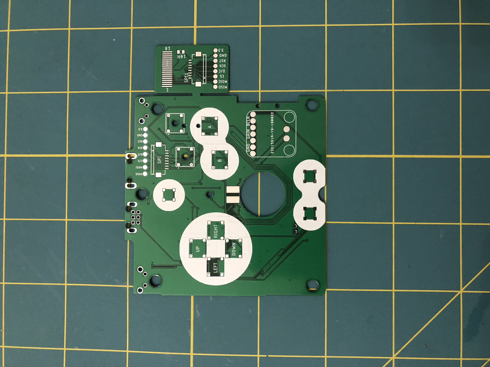
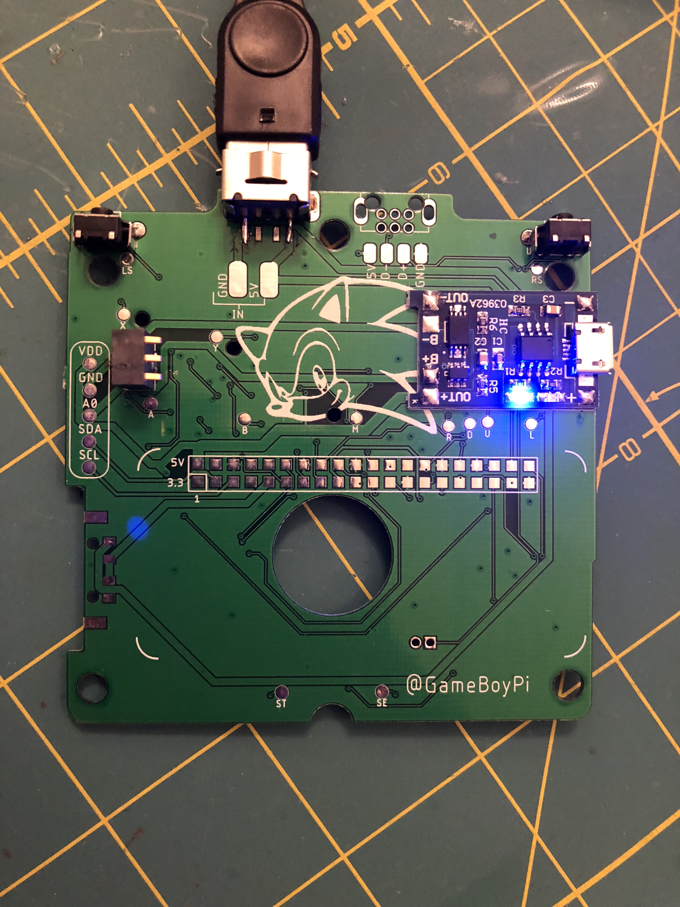
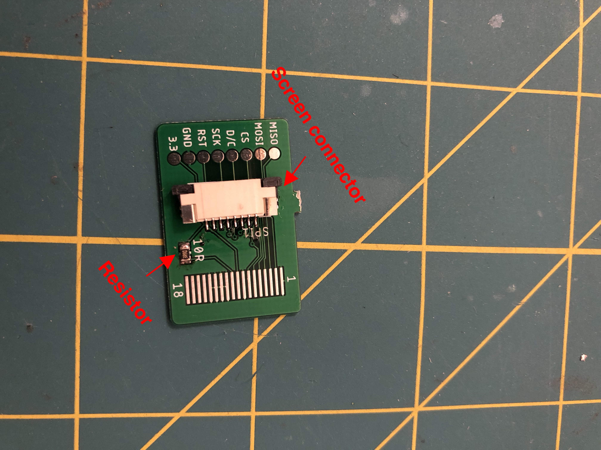
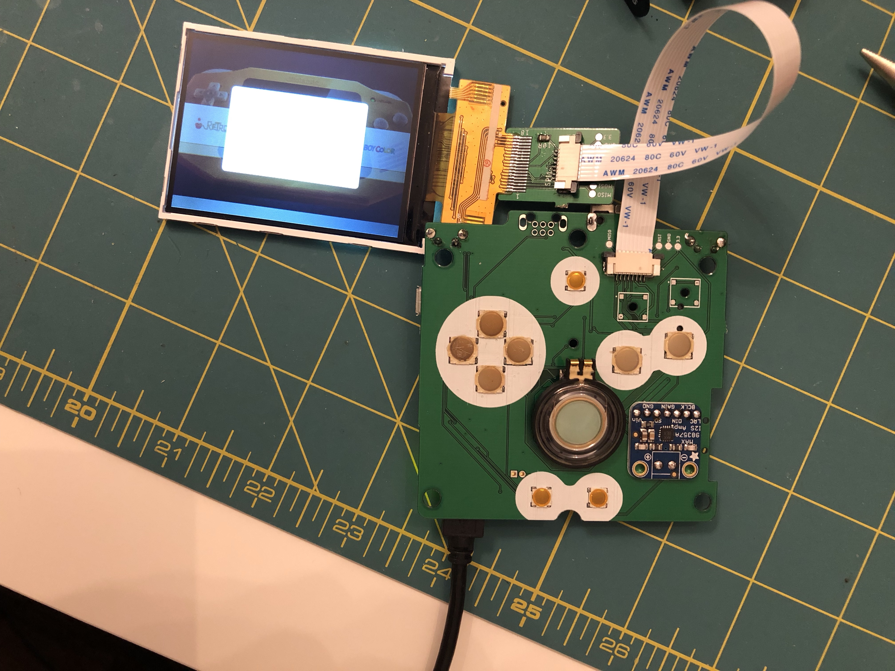
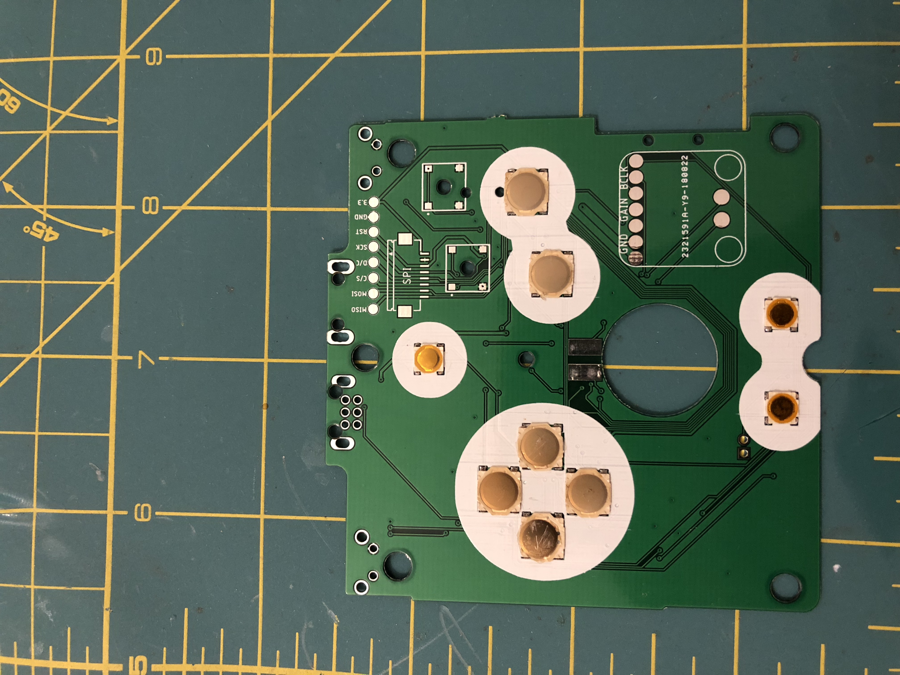
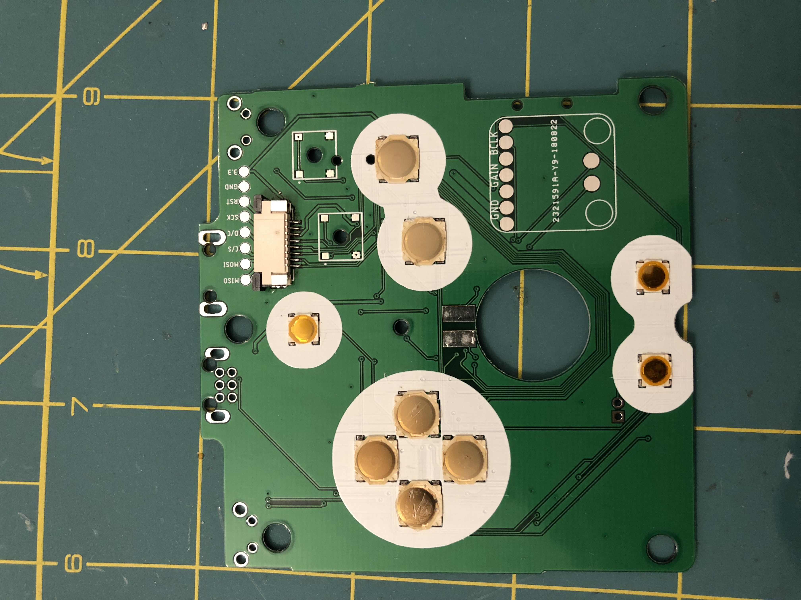
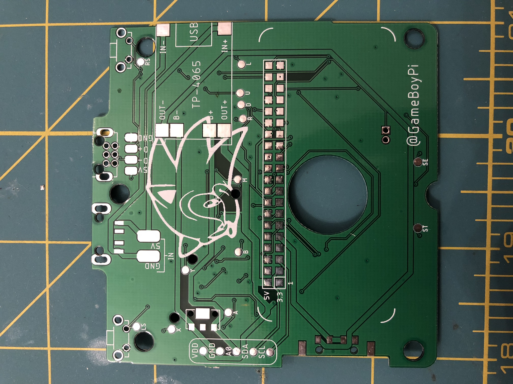
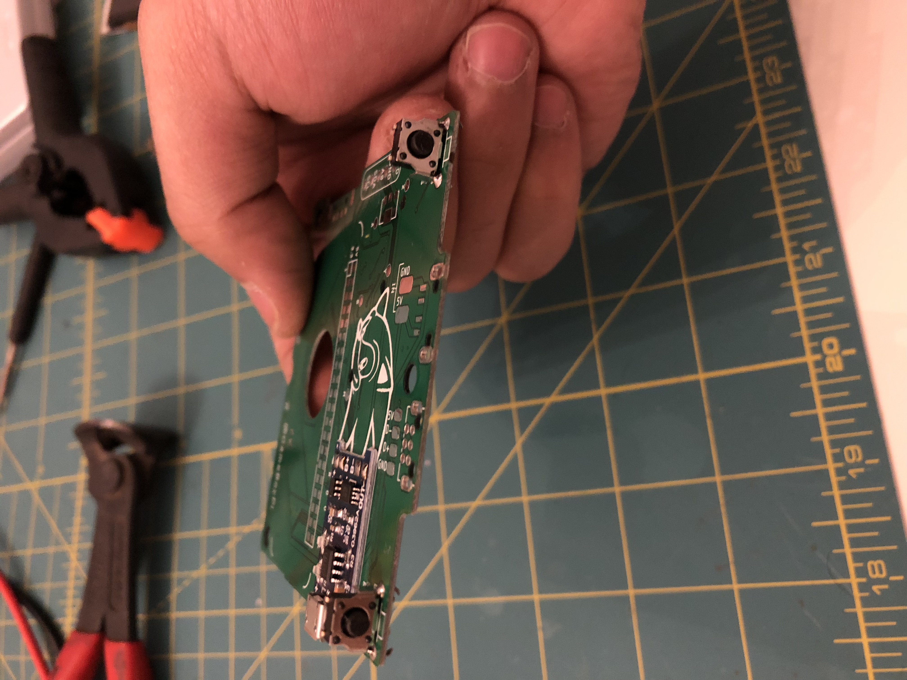
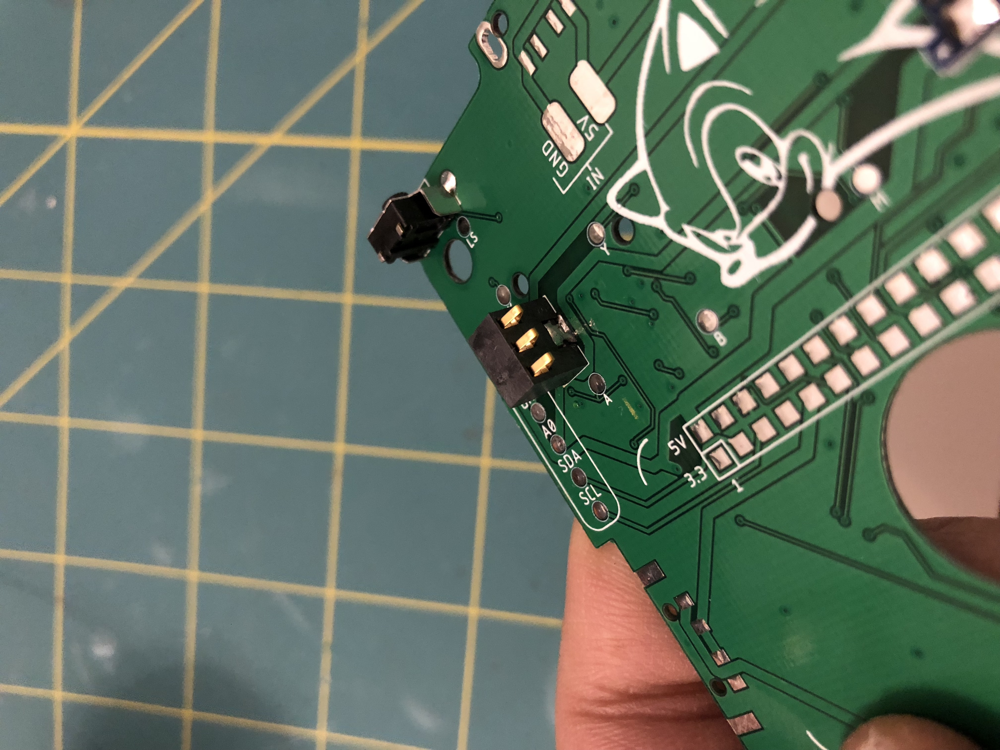

# PCB Assembly

+speaker ^
### Image of the PCB

### 1- `Top of the PCB` install your buttons + Adafruit I2S audio + screen connector

### 2- `Bottom of the PCB` install your L&R Buttons + TP4506 charger + Battery terminal

### 3- install the power switch

### 4- (This part is optional if you want to use the original SP charging port)
Cut all the pins Except those referred to 

install the SP port and try it out, the charger should flash blue light so it's working!!

### 5- install your raspberry pi.

### 6- install the screen connector + resistor

### 7- install your screen

### Check the board (buttons + sound + screen) everything should work well, if not double check your soldering.

-----

### More images

