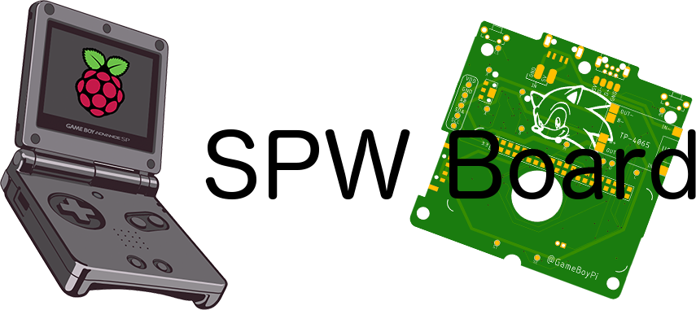

It's a simple pcb to powered your gameboy sp with raspberry pi w

### Features :
- support 2 ili9341 screen sizes 2.8 + 3.2
- i2s audio
- Gpio buttons " a + b + x + y + l + r + up + down + left + right + start + select "
- TP4056 for charging 
- battery monitor "ads1015" "optional"
- support 3 way for charging 
1- original sp port
2- micro usb
3- wireless charging

### Tips :
- #### board thickness is " 0.8 " other than that will not fit.
- You must have experience in what you do "I do not recommend you if this is your first build"
- #### I am not responsible for any damage you may get
- Buy a good quality housing 
- #### A little patience

### Steps :

#### [1- Case mod](https://github.com/Gameboypi/SPW/tree/master/Case%20mod)
#### [2- Build guide](https://github.com/Gameboypi/SPW/tree/master/Build%20guide)
#### [3- Closing the case](https://github.com/Gameboypi/SPW/tree/master/Closing%20the%20case)

